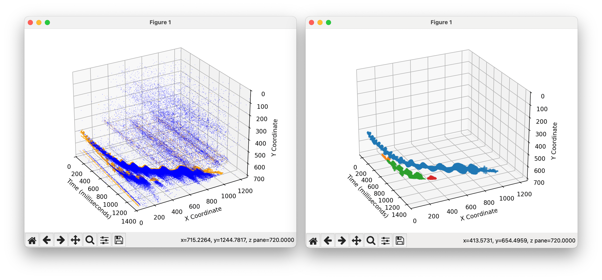
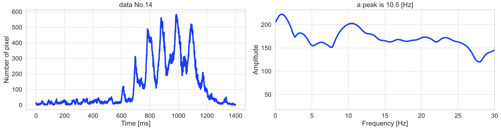

# evsBat
This repository is an adaptation of the tracking functionality from evsMarineSnow for bat analysis.
It is designed to track objects in event data without converting the data into event frames or voxels, allowing for direct tracking.
The output data consists of the trajectory of the centroid and point clouds of events that make up the tracked objects. 
In post-analysis, frequency analysis of the variations in event count is also possible.

#### Input & Output


#### Output2: frequency



## Features
- Direct tracking: Processes event-based camera data streams directly, avoiding the need for frame or voxel conversion.
- Trajectory data: Outputs the trajectory of the object’s centroid for further analysis.
- Event point clouds: Provides point clouds of the events that form each tracked object, allowing for detailed post-processing.
- Frequency analysis: Enables the analysis of event count fluctuations over time, useful for observing periodic patterns in the data.

## Project Structure
```bash
.
├── sampleData/                    # Example CSV / PKL / PNG assets
│   ├── recording_2023-09-14_20-42-19_39.csv
│   ├── particle_tracking_results_recording_2023-09-14_20-42-19_39.pkl
│   └── fftAnalysis.png
├── particle_tracking.cpp       # Handles event-based particle tracking in C++
├── peak_collection.py        # Collects peak frequency data from multiple txt files and generates violin plots
├── plotAllData.py          # Plotting script for All data
├── plotEventCountFFT.py      # Performs FFT analysis on event count variations using a Hamming window
├── plotTrajectory.py          # Plots trajectory data from tracked events
├── setup.py                 #  Script for building the C++ code for particle tracking
├── trackParticlesC.py                 # Prticle tracking code
├── detect_peaks.py             # Utility for detecting peaks in FFT data
├── process_fft.py              # Helper functions for FFT processing
├── time_fft_to_pdf.py          # Converts time-domain FFT results to a PDF
└── README.md                 # Project documentation (this file)
```

## Modules Overview
### setup.py
Script for building the C++ code using pybind11. It compiles the particle_tracking.cpp file into a Python module (particle_tracking). This code is now only tested on M1 mac and Windows 11 environments.

```bash
python3 setup.py build_ext --inplace
```

### trackParticlesC.py
Reads and processes CSV files generated from .RAW files, performs particle tracking using a C++ module, and saves the results. It reads event data, optionally filters it by polarity (if needed), and applies parameters such as spatial and temporal thresholds for particle detection. The tracked particle data, including centroid histories and event points, is saved as a pickle file for further analysis.
You need to change parameters (sigma_x, sigma_t, gaussian_threshold, m_threshold) in the scripts.

#### Arguments
- -i Path to the input csv file or directory.

### plotTrajectory.py
Reads particle tracking data from a pickle file and plots the centroid trajectories of particles in 3D. The script also has an option to plot individual events associated with each particle, either fully or by sampling the data for visualization purposes.

#### Arguments
- -i Path to the input CSV file.

### plotEventCountFFT.py
Performs FFT analysis on event count variations from particle tracking data. The script processes pickle files generated from tracking data and calculates the event counts over time. It then applies FFT to the event counts, identifies peaks in the frequency domain, and saves both the peak data and corresponding FFT plots. The results are output in both text and PNG formats for further analysis.

#### Arguments
- -i Path to the input pickle file or directory.

## License
This project is licensed under the MIT License - see the [LICENSE](LICENSE) file for details.
