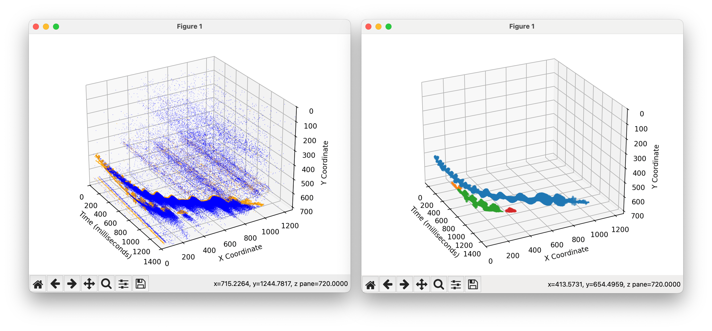
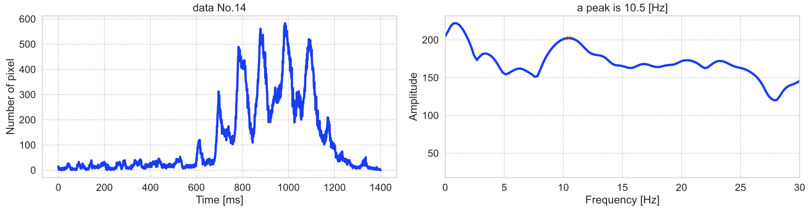

# evsBat
This repository is an adaptation of the tracking functionality from evsMarineSnow for bat analysis.
It is designed to track objects in event data without converting the data into event frames or voxels, allowing for direct tracking.
The output data consists of the trajectory of the centroid and point clouds of events that make up the tracked objects. 
In post-analysis, frequency analysis of the variations in event count is also possible.

#### Input & Output


#### Output2: frequency



## Features
- Direct tracking: Processes event-based camera data streams directly, avoiding the need for frame or voxel conversion.
- Trajectory data: Outputs the trajectory of the object’s centroid for further analysis.
- Event point clouds: Provides point clouds of the events that form each tracked object, allowing for detailed post-processing.
- Frequency analysis: Enables the analysis of event count fluctuations over time, useful for observing periodic patterns in the data.

## Project Structure
```bash
.
├── detect_peaks.py            # Utility helper for FFT peak detection
├── particle_tracking.cpp      # C++ implementation of the particle tracker (pybind11 extension)
├── plotAllData.py             # Visualise raw event CSV data in 3D
├── plotEventCountFFT.py       # FFT analysis of event-count time series
├── plotHalf.py                # Plot upper/lower event splits created by splitTrajectory.py
├── plotTrajectory.py          # Plot tracked particle trajectories from pickle files
├── process_fft.py             # Shared FFT processing helpers
├── sampleData/                # Example CSV / PKL files and generated assets
│   ├── recording_2023-09-14_20-42-19_39.csv
│   ├── particle_tracking_results_recording_2023-09-14_20-42-19_39.pkl
│   └── outputs/
├── setup.py                   # Build script for the particle_tracking extension
├── splitTrajectory.py         # Split the densest particle events into upper/lower sets
├── tests/                     # Unit tests
├── time_fft_to_pdf.py         # Export FFT results to PDF
├── trackParticlesC.py         # Python entry point for running the tracker
└── README.md                  # Project documentation (this file)
```

## Analysis Flow

The sample dataset in `sampleData/` already contains a raw CSV capture plus the pickled results produced by the tracker.  
To repeat the full pipeline starting from the CSV (and regenerate the derived artifacts), follow the steps below.

1. **Build the tracker extension (first time only)**
   ```bash
   python -m pip install -U pip setuptools wheel pybind11
   python setup.py build_ext --inplace
   ```

2. **Track particles from the CSV**
   ```bash
   python trackParticlesC.py -i sampleData/recording_2023-09-14_20-42-19_39.csv
   ```
   - Produces `sampleData/particle_tracking_results_recording_2023-09-14_20-42-19_39.pkl` containing centroid histories and event lists.

3. **Split the densest trajectory into upper / lower event sets**
   ```bash
   python splitTrajectory.py -i sampleData/particle_tracking_results_recording_2023-09-14_20-42-19_39.pkl
   ```
   - Writes pickle files under `sampleData/outputs/upper` and `sampleData/outputs/lower`.

4. **Inspect trajectories or event clouds (optional visual checks)**
   ```bash
   # 3D scatter of the raw events
   python plotAllData.py -i sampleData/recording_2023-09-14_20-42-19_39.csv

   # Centroid trajectory plots
   python plotTrajectory.py -i sampleData/particle_tracking_results_recording_2023-09-14_20-42-19_39.pkl

   # Visualise upper/lower split results
   python plotHalf.py -i sampleData/outputs
   ```
   - Each command saves figures into an `outputs/` folder next to the input data.

5. **Run frequency analysis on the tracked events**
   ```bash
   python plotEventCountFFT.py -i sampleData
   ```
   - Generates PDFs (time series + FFT) and `peak_freqs.csv` under `sampleData/`.
   - Uses helper utilities from `process_fft.py`, `detect_peaks.py`, and `time_fft_to_pdf.py` to locate dominant wing-beat frequencies.

Repeat the above against your own CSV directories by swapping the `-i` paths.

## Modules Overview
### setup.py
Build script for the `particle_tracking` pybind11 extension defined in `particle_tracking.cpp`. It uses `setuptools` and pulls the necessary include paths from `pybind11`. After installing the Python requirements (see `setup.py` dependencies), build the extension in-place:

```bash
python -m pip install pybind11 setuptools wheel
python setup.py build_ext --inplace
```

The command produces `particle_tracking.*.so` (or `.pyd` on Windows) next to the source file so the Python utilities can import it.

### trackParticlesC.py
CLI wrapper for the `particle_tracking` extension. It loads CSV event streams, applies the configurable tracker parameters (`sigma_x`, `sigma_t`, `gaussian_threshold`, `m_threshold`), and writes a pickle per CSV containing centroid histories and raw events. Tweak the parameters to match your scene before running:

```bash
python trackParticlesC.py -i path/to/events.csv
```

#### Arguments
- `-i / --input` Path to an event CSV file or a directory that contains multiple CSV files.

### splitTrajectory.py
Loads a particle-tracking pickle, finds the particle with the most events, smooths its centroid path, and splits the events into “upper” and “lower” sets relative to that trajectory. The separated events are written as pickles under `<input>/outputs/upper` and `<input>/outputs/lower` so `plotHalf.py` can visualise them later.

#### Arguments
- `-i / --input` Path to a particle-tracking pickle file or a directory containing multiple pickles.


### plotTrajectory.py
Loads particle-tracking pickle files, renders each particle’s centroid trail in 3D, and samples the per-event scatter for visibility. Images are written to an `outputs` folder beside the source file or directory.

#### Arguments
- `-i / --input` Path to a particle-tracking pickle file or directory of pickle files.

### plotAllData.py
Downsamples from raw event CSVs and renders them in a shared 3D scatter plot. Use it to inspect the full event stream before tracking. Images are written to an `outputs` folder next to the provided file or directory.

#### Arguments
- `-i / --input` Path to an event CSV file or directory containing CSV files.

### plotHalf.py
Consumes the upper/lower event pickles created by `splitTrajectory.py` and plots them together. By default it renders a 3D scatter of time vs. x/y; pass `--2d` to view only the spatial projection. Output images are saved to an `outputs` directory beside the supplied folder.

#### Arguments
- `-i / --input` Path to a directory that contains `upper` and `lower` pickle folders.
- `--2d` Render only the x/y view instead of the 3D time plot.

### plotEventCountFFT.py
Aggregates event counts from pickle files, applies FFT analysis, and exports summaries (CSV, PDFs) that highlight dominant frequencies. Uses helper modules in `process_fft.py`, `detect_peaks.py`, and `time_fft_to_pdf.py` for the heavy lifting.

#### Arguments
- `-i / --input` Path to a directory containing categorized pickle files or a single pickle file.

### process_fft.py
FFT utility functions shared by `plotEventCountFFT.py`, including windowing and spectrum calculation helpers.

### detect_peaks.py
Helper routines for peak detection inside FFT magnitude spectra. Called from `plotEventCountFFT.py` to isolate dominant frequencies.

### time_fft_to_pdf.py
Formatting utilities that render event-count time series and frequency plots into PDF reports. Invoked by `plotEventCountFFT.py`.

## License
This project is licensed under the MIT License - see the [LICENSE](LICENSE) file for details.
